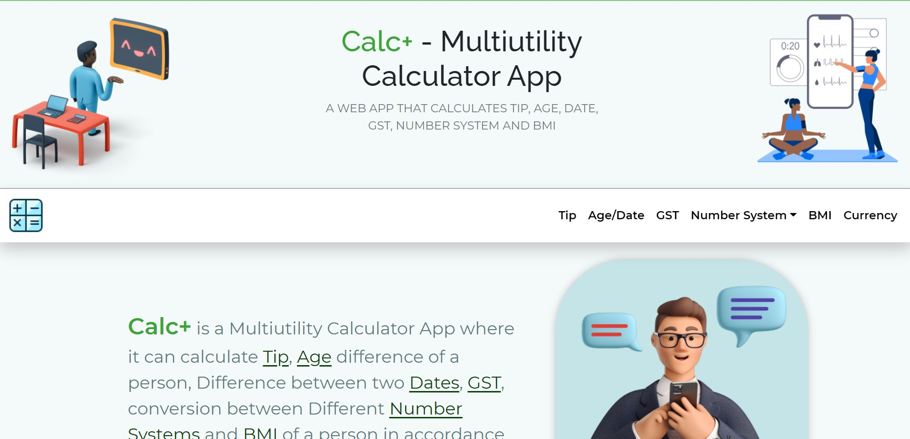

<h1 align="center">Calc+- MultiUtility Calculator app</h1>

## Hello! 👋

**This Web Application has been made by using HTML, CSS and JavaScript.**

## What is this Web Application used for??🤔

This Web Application is a Single Web Page which consists of Various Simple tools which might be used by users on the occasioon of their needs. The Simple Web Tools include : - 

<h1> 1. A Tip Calculator</h1>

 A tip calculator which will not only help you to split `bill`, but also calculate the `tip` which has to be payed, `per person`

<h1> 2. Age Difference Calculator</h1>

 This is a calculator that allows you to compute the age difference in a relationship or between any two people. It simply generates the ages of the two subjects according to the birth dates you input in the form and once you press Calculate it delivers the result.

<h1> 3. GST Tax Calculator</h1>

 GST calculator segregates the tax amount into CGST, SGST and IGST. With the help of a GST calculator, you will know how much tax will be levied on the goods/services being supplied. It additionally saves time and decreases the uncertainties of human error while calculating the total price of goods and services.

<h1> 4. Number System</h1>

 System Converter Online works well on Windows, MAC, Linux, Chrome, Firefox, Edge, and Safari. You can convert Binary to Decimal / Hexa-decimal / Octal or Octal to Binary / Hexa-decimal / Octal or Decimal to Binary / Hexa-decimal / Octal or Hexa-Decimal to Binary / Octal / Decimal.

<h1> 5. BMI Calculator</h1>

 BMI is a scale that measures a person's leanness or corpulence based on their height and weight. It is used to estimate tissue mass. It is commonly used as a general measure of whether a person's body weight is appropriate for their height. Specifically, the BMI value is used to determine whether a person is underweight, normal weight, overweight, or obese, based on where the number falls within the range. 

<h1> 6. BMI Calculator</h1>

 Calculate live currency, foreign exchange rates via currency converter on Calc+ . Convert between all major global currencies starting from American Dollars, Euros, UK's Pound Sterling, Canadian Dollar, Chinese Yuan , Australian Dollar, Indian Rupee, Japanese Yen, Qatar Rial, Saudi Rial, Turkish Lira, etc. 

## Deploying site

Access the Live Site [here](https://www.calc-multiutility.netlify.app/)

- Share amongst your friend - [GitHub Link](https://github.com/AmitSahoo45/calc-multiutility-app.git)

<h3 align="center">Connect with me:</h3>

 &nbsp;&nbsp;&nbsp;&nbsp;
&nbsp;&nbsp;&nbsp;&nbsp;

